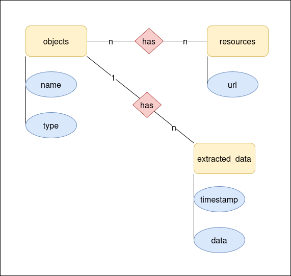
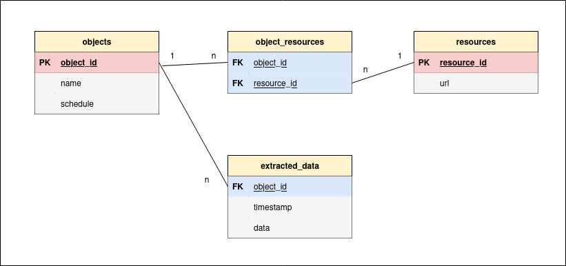

# etl-extract
## Project description
This project is one part of a super project [analyzer](https://github.com/JuginPower/analyzer) and is part of a so-called 
ETL pipeline. It should represent the entire extraction process and be able to run as a standalone software system, 
independent of the other processes such as the transform and load process. I want to achieve better maintainability and 
expandability for the future with that.

## Vision
My vision is to use this extract process to develop a kind of web scraper that can extract data from different sources 
at specific times and after specific events. This should all be controlled with Apache Airflow.

## Features

### database design
#### ERM-Diagram
So when I want to extract data I need a database where I can save the data right? Therefore, I developed a data model 
using an Entity Relational Diagram according to Chen Notation, as shown below:

##### objects and resources
I left the naming of the entity objects vague on purpose. You could also just call it an object. This object can be 
anything, such as a string, an integer or a floating point number for now. It also has a multiple relationship to the 
resources entity, you can see this from the n's. So the resources can also contain multiple objects and vice versa.

##### attributes
The blue circles are the attributes of each entity that are important.
to mention. And for the sake of clarity, I have not drawn all of them that I will use in the final database design. 
You can see this in the finished data model below.

##### extracted data
The extracted data entity is always associated with a single object. But an object can have many extracted data.
It's a very simple way to categorize scrapped and otherwise extracted data. For now, that’s enough.

### Datamodels
Based on the assumptions I made when creating the ERM diagram, my database will ultimately look like the following:

I have resolved the multiple relationship between the objects and the resources in an intermediate table that stores 
the primary keys of both tables. I added also a schedule attribute to objects. It will hold the schedule plan for 
particular object as a string like daily, weekly, hourly and so on.
At this point I have to say that this is only a very rough simplification of a planner that belongs in every ETL 
pipeline. After all, you have to be able to complete tasks in a certain order or after certain events during the 
extraction process. But I am following the KISS principle here and trying to come up with a productive and 
uncomplicated solution as quickly as possible.